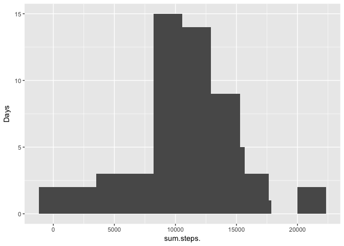
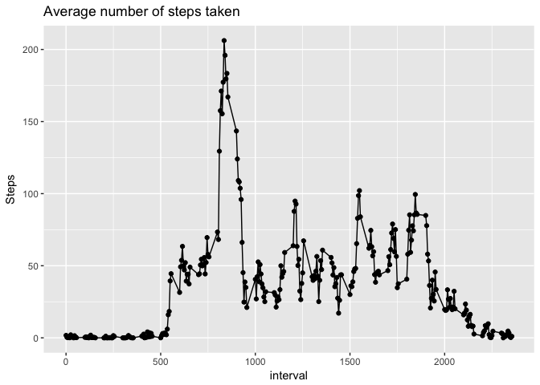
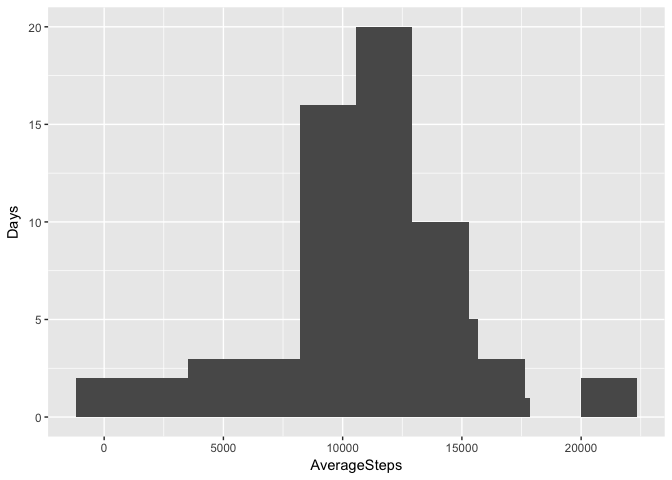
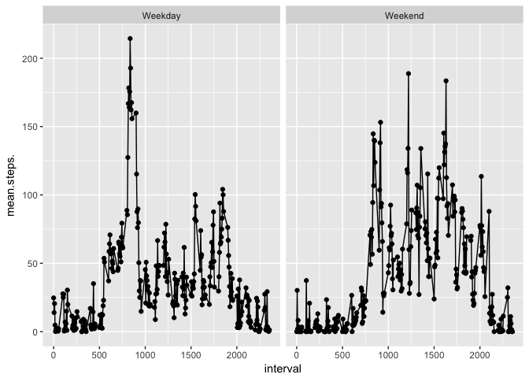

# Reproducible Research: Peer Assessment 1

## Loading and preprocessing the data


```r
library(dplyr)
library(ggplot2)
library(lubridate)
library(mice)
```


```r
if (!file.exists("activity.csv")) {unzip("activity.zip", exdir = "./") }

activity <- tbl_df(read.csv("activity.csv", header = TRUE)) %>%
                na.omit() %>% # omit missing values
                mutate(date = ymd(date))
```


## What is mean total number of steps taken per day?


```r
dailySteps <- group_by(activity, date) %>%
                summarize(sum(steps), mean(steps), median(steps))
names(dailySteps) = make.names(names(dailySteps))

#histogram of the total number of steps taken each day 
qplot(sum.steps., data = dailySteps, ylab="Days")+geom_histogram()+stat_bin(bins=10)
```

```
## `stat_bin()` using `bins = 30`. Pick better value with `binwidth`.
## `stat_bin()` using `bins = 30`. Pick better value with `binwidth`.
```

<!-- -->

```r
# calc mean & median
dailyMean <- mean(dailySteps$sum.steps., na.rm=TRUE)
dailyMedian <- median(dailySteps$sum.steps., na.rm=TRUE)
```

mean of the total number of steps taken per day: 1.0766189\times 10^{4}  
median of the total number of steps taken per day: 10765


## What is the average daily activity pattern?

```r
activity <- ungroup(activity) %>% group_by(interval) 
intervalSummary <- summarize(activity, mean(steps))
names(intervalSummary) = make.names(names(intervalSummary))
qplot(interval, mean.steps., data = intervalSummary, ylab="Steps", main="Average number of steps taken")+geom_line()
```

<!-- -->

```r
interval_max <- unlist(intervalSummary[which.max(intervalSummary$mean.steps.),1])
```
Which 5-minute interval, on average across all the days in the dataset, contains the maximum number of steps? Answer: **835**


## Imputing missing values


```r
activity2 <- tbl_df(read.csv("activity.csv", header = TRUE)) 
missingValues <- activity2[!complete.cases(activity2),] #subset all obs with missing data

#impute missing data using pmm: predictive mean matching comes with "mice" package
imputedData <- mice(activity2, m=1, maxit=10,method="pmm", seed=500) 
activity2 <- complete(imputedData,1) %>%
                mutate(date = ymd(date))
                
# summarize
dailySteps2 <- group_by(activity2,date) %>%
                summarize(sum(steps), mean(steps), median(steps))
names(dailySteps2) = make.names(names(dailySteps2))
# plot
qplot(sum.steps., data = dailySteps2,ylab="Days")+geom_histogram()+stat_bin(bins=10)
```

<!-- -->

```r
# calc mean & median
dailyMean <- mean(dailySteps2$sum.steps., na.rm=TRUE)
dailyMedian <- median(dailySteps2$sum.steps., na.rm=TRUE)
```

Calculate and report the total number of missing values in the dataset: **2304**  
Mean & median after data being imputed: 
mean of the total number of steps taken per day: 1.0908328\times 10^{4}  
median of the total number of steps taken per day: 11107

## Are there differences in activity patterns between weekdays and weekends?


```r
activity2 <- mutate(activity2, Weekday =wday(date,label=T))
activity2$Weekday <- sub("Sun|Sat", "Weekend", activity2$Weekday)
activity2$Weekday <- sub("Mon|Tues|Wed|Thurs|Fri", "Weekday", activity2$Weekday)

intervalSummary2 <- group_by(activity2,Weekday, interval) %>% summarize(mean(steps))
names(intervalSummary2) = make.names(names(intervalSummary2))
qplot(interval, mean.steps., data=intervalSummary2,facets=.~Weekday) + geom_line()
```

<!-- -->

